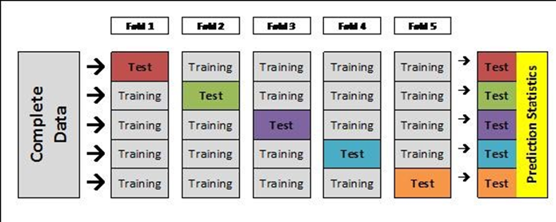

```{r setup, include=FALSE}
knitr::opts_chunk$set(echo = TRUE)
#package for plotting 
library(ggplot2)
#package for cleaning data and logical things 
library(tidyverse)
# weather station data from NOAA API 
library(rnoaa)

#time series related 
library(forecast)
#install.packages("xts")                      # Install & load xts package
library("xts")

library(ClusterR)
library(cluster)
library(broom)

#other packages for kmeans
library(here)
library(tidymodels)


## allows us to read in large amounts of data
library(data.table)
```

# OCDS Advanced Track Tutorial{.tabset}


## Tutorial Learning Goals

Welcome to the NCSCO OCDS Intro track tutorial. We are  [Nick Gawron](https://www.linkedin.com/in/ngawrondata/) and [Livia Popa](https://www.linkedin.com/in/livia-popa-23a018183/), we will be working with you through today's tutorial.  We will be using R studio for today's session. 

We will be tackling these objectives:

- *Define* open data and reproducible science
- *Recognize* the importance of statistical analysis for climate data analysis using cloud based data
- *Apply* techniques to access and explore publicly available climate data from the cloud using exploratory data analysis (i.e. tidyverse)
- *Create* a machine learning model to predicts results for a representative case study

### Meet Mr. Wuf!

Mr. Wuf works for Mount Mitchell State Park in Burnsville, NC and was recently asked by his boss to write a report summarizing rainfall and temperature data for 2021. This report will be used to help optimize 2022 event planning (e.g., fall color viewing) for park visitors and maintenance scheduling for park staff. He recently got promoted to the head office of the NC State Climate office! Mr. Wuf’s wife, Mrs. Wuf, recently told him about the State Climate Office of North Carolina’s new nClimgrid and Econet data portals. He agrees with her that it would be a great opportunity to check out these new, free tools. After some preliminary sleuthing around nClimgrid, he discovered there was a Monthly U.S Climate Gridded Dataset (nClimGrid; https://www.ncei.noaa.gov/access/metadata/landing-page/bin/iso?id=gov.noaa.ncdc:C00332). How did he miss this? Once he downloads these data from nClimGrid and Econet, Mr. Wuf plans to put the skills he learned in an online R programming course to the test for this real-world, work-related project.\

## API 

### API Introduction 

- API is the acronym for Application Programming Interface that enables applications to exchange data and functionality easily and securely.

- The API data that we will be using is called nClimgrid which consists of four climate variables derived from the GHCN-Dataset: maximum temperature, minimum temperature, average temperature, and precipitation. 

### nClimgrid Data Set

```{r}

## Read in data from AWS nClimGrid 2020-2021
nclim_2020s<-read_csv('https://noaa-nclimgrid-daily-pds.s3.amazonaws.com/EpiNOAA/decadal/2020-2021-ste-decadal.csv')%>%drop_na()
```

```{r}

## Read in nClimGrid 2010-2019
nclim_2010s<-fread('https://noaa-nclimgrid-daily-pds.s3.amazonaws.com/EpiNOAA/decadal/2010-2019-ste-decadal.csv')%>%drop_na()

```

```{r}
#If computation time takes a while ... we have   a .Rda file 
load("NCLIM2010.Rda")
```


```{r}
## Lets quickly combind the data sets to get a data set ranging from the above
## lets also filter for data record that pertain to North Carolina
nclim <- rbind(nclim_2020s,nclim_2010s)%>%filter(state == c("North Carolina", "South Carolina"))
```


```{r}
## Using the whole data set, subset values to only look at the years 2019 to 2020
## We will be using this data set for k-means clustering later
## Call the data set nclimk 
## This data set will have 34 thousand objects

nclimk<-rbind(nclim_2020s,nclim_2010s)%>%filter(date > "2019-01-01" & date <"2020-12-31")
```


Using the formula $(C × \frac{9}{5}) + 32=F$, covert the temperature to Fahrenheit. 


```{r}
CtoF<- function(datcols){
  x<- (9/5)*datcols+32
  return(x)
}
```

## Applying functions Basics

```{r}
#apply the ufnction CtoF with tidyverse
nclim[8:10]<- nclim[8:10]%>% lapply(CtoF)
head(nclim)
```


```{r}
## Apply Tidyverse piping to easily add degree labels  to the end of certain coloumns for temp
## and to add units for precipitation
colnames(nclim)[8:10]<-colnames(nclim)[8:10]%>%tolower()%>% paste0("_degf")
colnames(nclim)[7]<-colnames(nclim)[7]%>%tolower()%>% paste0("_cm")

head(nclim)
```

```{r}
## Keep the weather data coloumns as well as the date, drop all other coloumns 
## Further Create the variable ifRain: a factor to indicate wether it rained on a certain day
## Call this final data set nclimf

nclimf <- nclim %>% select(date,prcp_cm,tavg_degf,tmin_degf,tmax_degf,state)%>%
                    mutate(ifNC=as.factor(as.integer(state=="North Carolina")))%>%
                    mutate(ifRain= as.factor(as.integer(prcp_cm>0)))%>%
                    select(-state)
                           
                           
head(nclimf)
```

## Cleaning for nclimk

```{r}
### bwlow we do the same clean 
```


## EDA


- We will inspect the data through a couple graphs as well as a simple linear regression

```{r}
# scatterplot of avg tempurature vs time, color the points red
## add labels
## save the plot at plotOTemp
plotOtemp<-ggplot(nclim,aes(x=date,y=tavg_degf))+geom_point(colour="red")+labs(x = "Date", y = "Average Tempurature (F)",title ="Tempurature Over Time")
plotOtemp
```


## Machine Learning 


### Simple Regression 

- 

```{r}
plotOtemp+geom_smooth(method="lm",se=TRUE,col = "black")+theme_classic()
```

### Time Series 

- A time series is a collection of observations of well-defined data items obtained through repeated measurements over time

- Time series analyze a sequence of data points collected over an interval of times

- We will now try to fit a time series model to this data rather than a regression to see if the results improve


```{r}

## with the variables date and avergae tempurature, create a time series object. 
## save as temp_ts
temp_ts<-xts(nclimf$tavg_degf,nclim$date)
```


```{r}
#plot the time series object we called temp_ts
plot(temp_ts)
```


### K-Means Clustering in nClimGridData

#### Creating Functions

```{r}
calculate_cluster <- function(data, k) {
  x <- data %>%
    na.omit() %>%
    scale()
  
  df <- kmeans(x, center = k) %>%
    augment(data) %>% # creates column ".cluster" with cluster label
    mutate(silhouette = cluster::silhouette(as.integer(.cluster), dist(x))[, "sil_width"]) # calculate silhouette score
  
  return(df)
}

```


```{r}
plot(nclimf$date,nclimf$tavg_degf)

data2cluster<-data.frame(nclimf$date,nclimf$tavg_deg)

df<-calculate_cluster(data2cluster,4)
df
```


```{r}

  # data subset
  temp_coop_data <- coop_data %>%
    select(station, date, tempmax_c) %>%
    mutate(doy = yday(date)) %>%
    filter(station == temp_station) %>% # select one station for now
    select(doy, tempmax_c) %>%
    na.omit()
  
  # test function
  # calculate_cluster(data = coop_data_small, k = 2)
  
  # map cluster calculations function to range of k values
  temp_cluster_data <- tibble(k = 2:12) %>%
    mutate(kclust = map(k, ~calculate_cluster(temp_coop_data, .x))) %>%
    unnest(cols = c(kclust))
  

  
  # calculate silhoutte score (highest for optimal number of k clusters)
  temp_sil_score_data <- temp_cluster_data %>%
    group_by(k) %>%
    summarize(avg_sil_score = mean(silhouette, na.rm = TRUE))
  
  # find maximum
  temp_optimal_sil_score_data <- temp_sil_score_data %>%
    filter(max(avg_sil_score, na.rm = TRUE) == avg_sil_score)
  
  # save optimal k
  temp_optimal_k_value <- temp_optimal_sil_score_data$k
  
  # print status
  print(paste0("optimal number of clusters was k = ", temp_optimal_k_value))
  
  # save optimal k cluster data
  temp_cluster_data_sel <- temp_cluster_data %>%
    filter(k == temp_optimal_k_value) %>%
    mutate(station = temp_station)
  
  # append data
  coop_tempmax_optimal_cluster_data <- bind_rows(temp_cluster_data_sel)
  


# quick look
length(unique(coop_tempmax_optimal_cluster_data$station))
unique(coop_tempmax_optimal_cluster_data$k)
# optimal k is always 3

# plot outputs tempmax vs doy
ggplot(data = coop_tempmax_optimal_cluster_data) +
  geom_point(aes(x = doy, y = tempmax_c, color = .cluster), alpha = 0.5) + 
  facet_wrap(~ station) +
  labs(x = "Day of Year", y = "Max. Air Temperature (C)", color = "Cluster ID")

# plot outputs density of doy colored by cluster
ggplot(data = coop_tempmax_optimal_cluster_data) +
  geom_density(aes(x = doy, fill = .cluster), alpha = 0.5) + 
  facet_wrap(~ station, scale = "free") +
  labs(x = "Day of Year", y = "Density", fill = "Cluster ID") +
  theme_classic()

# export
write_csv(x = coop_tempmax_optimal_cluster_data, file = here::here("data", "cluster_data", "coop_tempmax_optimal_cluster_data.csv"))

```


### PCA from Econet Data 

```{r}

cardinal <- read_csv("cardinal_data.csv", 
     col_types = list(`Average Air Temperature (F)` = col_number(), 
         `Maximum Air Temperature (F)` = col_number(), 
         `Minimum Air Temperature (F)` = col_number(), 
         `Average Experimental Leaf Wetness (mV)` = col_number(), 
         `Total Precipitation (in)` = col_number(), 
         `Average Relative Humidity (%)` = col_number(), 
         `Average Soil Moisture (m3/m3)` = col_number(), 
         `Average Soil Temperature (F)` = col_number(), 
         `Average Solar Radiation (W/m2)` = col_number(), 
         `Average Station Pressure (mb)` = col_number()))

cardinal<-drop_na(cardinal)
str(cardinal)
cardinal$Date<-as.Date(cardinal$Date, tryFormats= c("%m/%d/%y"))
view(cardinal)

#changes col names
colnames(cardinal)=c("date","AvgT","MaxT","MinT","AvgLw","Tprep","AvgHum","AvgSm","AvgSt","AvgSr","AvgStp")


cardinal$IfRain<- (cardinal$Tprep>0)
cardinal$IfRain<-as.factor(as.integer(cardinal$IfRain))


```

### Basic Plotting with Ggplot 


```{r}
ggplot(cardinal,aes(x=date,y=AvgT))+geom_line()+labs(title="Total Daily Rainfall by Date",y="Average Tempurature (F) ", x= "Date")
```

- EDA is how we can motivate future ML models!

- We can use forecasting to extend this trend!


## Testing and training data

- How can we see how well a model works? 



### Time Series forecasting


- We were thinking of using logistic regression  but may not?

```{r}
#logistic regression
fit1 = glm(IfRain~date+AvgT+AvgLw+AvgSt+AvgSr, data=cardinal, family="binomial")
summary(fit1)

#predict something with logistic regression

```


```{r}

# n climate  grid data

temp_ts <- xts(cardinal$AvgT,cardinal$date)
head(temp_ts)
  
autoplot(temp_ts[1:600])

half_temp <-temp_ts[1:600]

library(forecast)
d.arima <- auto.arima(half_temp)
d.forecast <- forecast(d.arima, level = c(90), h = 200)
autoplot(d.forecast)

```


### PCA to cluster rain variable 


- using cardinal data to obsevre *if* there is clustering 

- used for future models

- helps us describe higher dimensional data with **less**


Three general steps: 

  1. Remove heavily correlated columns! 
    - Min Temp and Max Temp for a certain day will correlate with one another!
    
  2. Center Data

Observe: 

```{r}
library(corrplot)
corrplot(cor(cardinal[,-c(1,12)]))
```

- Tells us to remove all but one temperature variable


```{r}
IfRainVar<- cardinal$IfRain
cardshort <- cardinal%>%select(-c(date,IfRain,Tprep,MinT,MaxT))
cardshort

pca_card<- princomp(scale(cardshort,scale=FALSE),cor = FALSE)


plot(pca_card$scores, pch = 16, col =IfRainVar)
legend("topright",c("No Rain","Rain"),pch=16,col=c("black","red"))

```

- Here we can look at how good PCA does at describing changes in data 

- We see 2 components describes 96% of the data's variation ! (This is very good)

```{r}
summary(pca_card)
```


```{r}
screeplot(pca_card, type = "lines")
```


### How are the original variables related to the principal components?

- Does not print small values, less impactful to correlation 

```{r}
loadings(pca_card)
```


- The loading are simple correlations between the principal components and the original variables (Pearson’s r).

- Values closest to 1 (positive) or -1 (negative) will represent the strongest relationships, with zero being uncorrelated.

We see in PC 1 that there is a high positive correlation between AvgSr. We see the correlation between solar radiation and the component direction is quite high. So by looking at the second component or the y-axis of our previous plot: we see for the most part, Leaf wetness correlated well with the occurance of rain.   


- Another visual to observe the impact of each variable on the principal component!  

- Not super pretty here

```{r}
biplot(pca_card)
```

## Closing & Resources

- *Define* open data and reproducible science
- *Recognize* the importance of statistical analysis for climate data analysis using cloud based data
- *Apply* techniques to access and explore publicly available climate data from the cloud using exploratory data analysis
- *Create* a machine learning model to predicts results for a representative case study

\center
Any Questions? 
\center

### Resouces

- For a A Hydrologists Guide to Open Science, from the HESS Journal, click [here](https://hess.copernicus.org/articles/26/647/2022/). 

### Survey 

Thank you for attending the beginner track tutorial at the Open Climate Data Science Workshop. Please complete the voluntary feedback survey, linked [here](https://docs.google.com/forms/d/e/1FAIpQLSejTJjhvCLbCVKBotUa8VtDzYJBnMCilzPrB4VBzJrs7vXqIQ/viewform). The main purposes of this survey is to (1) determine we met specified teaching goals and (2) improve teaching materials for subsequent tutorial sessions.


